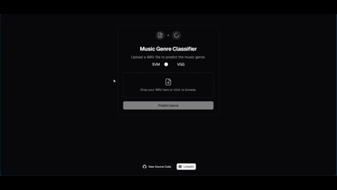

# Music Genre Classification

[](https://music-genre-classifier.vercel.app)
[](https://hub.docker.com/u/aziz02220)
[](https://nextjs.org/)
[](LICENSE)

Classify music genres from WAV audio files using two machine learning models — **SVM** (traditional ML) and **VGG19** (deep learning). Built with Flask backends, a Next.js frontend, and fully containerized with Docker.

<p align="center">
  
</p>

---

## Live Demo

| Service | URL |
|---|---|
| Frontend | [https://music-genre-classify.vercel.app](https://music-genre-classify.vercel.app) |
| SVM API | [https://music-genre-svm.onrender.com](https://music-genre-svm.onrender.com) |
| VGG19 API | [https://music-genre-vgg.onrender.com](https://music-genre-vgg.onrender.com) |

---

## Features

- **SVM Service** — Flask-based web service using a Support Vector Machine model trained on handcrafted audio features (MFCCs, spectral features, etc.)
- **VGG19 Service** — Flask-based web service using a VGG19 convolutional neural network on mel-spectrogram images
- **Next.js Frontend** — Modern UI with file upload, drag-and-drop, and SVM/VGG model toggle
- **Dockerized** — All components containerized with Docker Compose
- **CI/CD** — GitHub Actions for Docker builds & pushes, Jenkins pipeline for testing

---

## Project Structure

```
Music-Genre-Classification
├── .github/workflows      # GitHub Actions CI workflows
├── SVM_service            # Flask service for SVM model
│   ├── app.py             # SVM inference API
│   ├── Dockerfile         # SVM container
│   └── test.py            # Pytest tests
├── VGG19_service          # Flask service for VGG19 model
│   ├── app.py             # VGG19 inference API
│   ├── Dockerfile         # VGG19 container
│   ├── test.py            # Offline model test
│   └── test_flask.py      # Pytest tests
├── frontend               # Next.js 15 application
│   ├── app/               # App Router pages
│   ├── components/        # UI components (shadcn/ui)
│   ├── vercel.json        # Vercel deployment config
│   └── Dockerfile         # Frontend container
├── models                 # Pre-trained ML models
│   ├── svm_model.pkl      # Trained SVM classifier
│   └── scaler.pkl         # Feature scaler
├── dataset                # GTZAN dataset samples
├── test                   # Jenkins CI configuration
├── docker-compose.yaml    # Local orchestration
└── render.yaml            # Render deployment config
```

---

## Technologies

- **Machine Learning:** Scikit-learn (SVM), TensorFlow/Keras (VGG19)
- **Audio Processing:** Librosa, MFCC, Mel-spectrograms
- **Backend:** Flask, Flask-CORS, Gunicorn
- **Frontend:** Next.js 15, Tailwind CSS, shadcn/ui, Framer Motion
- **Infrastructure:** Docker, Docker Compose, GitHub Actions, Render, Vercel

---

## Quick Start (Local Development)

### Prerequisites

- [Docker](https://www.docker.com/get-started)
- [Docker Compose](https://docs.docker.com/compose/install/)

### Setup

```bash
git clone https://github.com/aziz0220/Music-Genre-Classification.git
cd Music-Genre-Classification
```

For VGG19 model download, set your Kaggle credentials:
```bash
export KAGGLE_USERNAME="your-kaggle-username"
export KAGGLE_KEY="your-kaggle-api-key"
```

### Run

```bash
docker compose up --build -d
```

### Access

| Service | URL |
|---|---|
| Frontend | [http://localhost:3000](http://localhost:3000) |
| SVM API | [http://localhost:5001](http://localhost:5001) |
| VGG19 API | [http://localhost:5002](http://localhost:5002) |

### Stop

```bash
docker compose down
```

---

## API Endpoints

### SVM Service (`http://localhost:5001`)

| Method | Endpoint | Description |
|---|---|---|
| GET | `/` | HTML upload form |
| POST | `/classify_genre` | Upload WAV file → returns `{"genre": "..."}` |

### VGG19 Service (`http://localhost:5002`)

| Method | Endpoint | Description |
|---|---|---|
| GET | `/` | HTML upload form |
| POST | `/vgg19_service` | Upload WAV file → returns `{"genre": "..."}` |

---

## Production Deployment

### Frontend → Vercel

The frontend is pre-configured for Vercel deployment. Connect the GitHub repository:

1. Go to [vercel.com](https://vercel.com) and import `aziz0220/Music-Genre-Classification`
2. Set root directory to `frontend/`
3. Add environment variables:
   - `NEXT_PUBLIC_SVM_URL` → `https://music-genre-svm.onrender.com/classify_genre`
   - `NEXT_PUBLIC_VGG_URL` → `https://music-genre-vgg.onrender.com/vgg19_service`
4. Deploy

### Backend Services → Render

Both backend services are configured for deployment on [Render](https://render.com) via `render.yaml`:

1. Go to [render.com](https://render.com) → Blueprint → Connect repository
2. Select `aziz0220/Music-Genre-Classification`
3. For the VGG19 service, set the following environment secrets:
   - `KAGGLE_USERNAME` — Your Kaggle username
   - `KAGGLE_KEY` — Your Kaggle API key
4. Deploy

### Manual Docker Deployment

```bash
docker compose -f docker-compose.yaml up --build -d
```

For production Docker images:
```bash
docker compose build
docker compose push
```

---

## Models

### SVM (Support Vector Machine)
- Trained on GTZAN dataset using hand-crafted audio features
- 57 features: MFCCs, spectral centroid, bandwidth, rolloff, zero-crossing rate, tempo, etc.
- Pre-trained model included in `models/svm_model.pkl` + `models/scaler.pkl`

### VGG19 (Deep Neural Network)
- Fine-tuned VGG19 CNN trained on mel-spectrogram images
- Input: 288×432 mel-spectrogram → prediction over 10 genres
- Model downloaded from Kaggle at build time (not stored in repo)

### Dataset
[GTZAN Dataset](https://www.kaggle.com/andradaolteanu/gtzan-dataset-music-genre-classification) — 1000 audio tracks across 10 genres:
`blues`, `classical`, `country`, `disco`, `hiphop`, `jazz`, `metal`, `pop`, `reggae`, `rock`

### Kaggle Notebooks
- [VGG19 Training](https://www.kaggle.com/code/aziz0220/real-deep-learning-project)
- [SVM Training](https://www.kaggle.com/code/aziz0220/svm-for-music-genres-classification)

---

## CI/CD

### GitHub Actions
- Builds Docker images and pushes to Docker Hub
- Runs automated tests against SVM and VGG19 services
- Triggered manually via `workflow_dispatch`

### Jenkins
- Jenkins pipeline in `test/Jenkinsfile`
- Jenkins Docker setup instructions in `test/Readme.MD`

---

## Testing

Run tests locally with Docker:
```bash
docker compose run --rm svm-test-runner
docker compose run --rm vgg-test-runner
```

---

## Author

**Aziz BEN AMOR** — [GitHub](https://github.com/aziz0220) · [LinkedIn](https://www.linkedin.com/in/aziz-benamor/)

---

## License

MIT
